# InterviewPilot AI

An AI-powered mock interview platform. Upload your resume and the job description, and it
runs an **adaptive** interview — evaluating every answer, then deciding whether to probe
deeper, offer a hint, or move on — and finishes with a scored report and a learning plan.

The loop is not `question → answer → question`. It is:

```
question → answer → evaluation → decision → { follow-up | hint | next | end }
```

**Stack** — Next.js 16 (App Router, TypeScript, Tailwind v4) · FastAPI · SQLAlchemy ·
PostgreSQL · Redis · WebSockets · OpenAI Responses API with Structured Outputs.

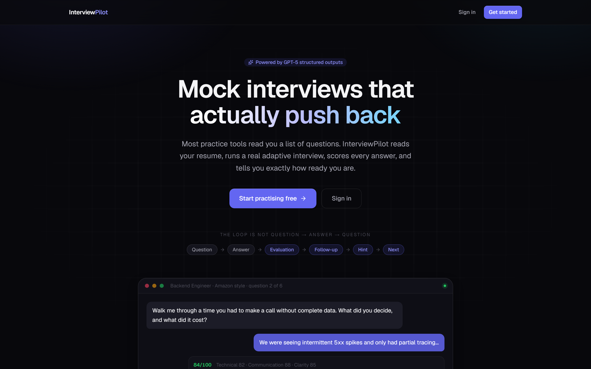

---

## Screenshots

### The interview room

The adaptive loop, on screen: the answer is scored the moment it lands, and that score is
what decides whether the next line is a follow-up, a hint, or a new question. Here the
answer scored 83, so the interviewer probed deeper instead of moving on.

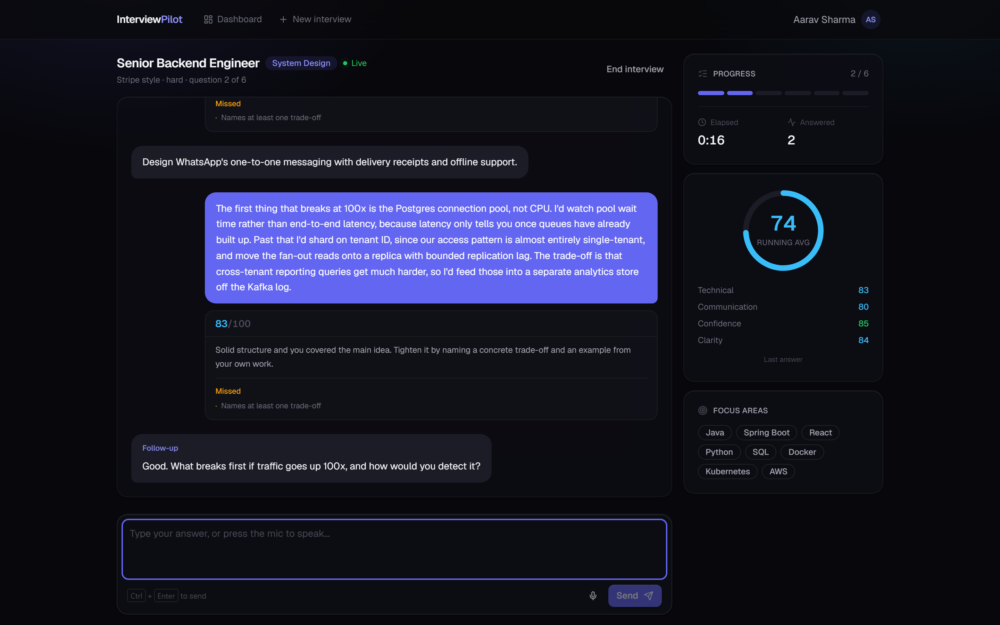

Live progress, a running average and the skills being probed sit alongside the transcript.

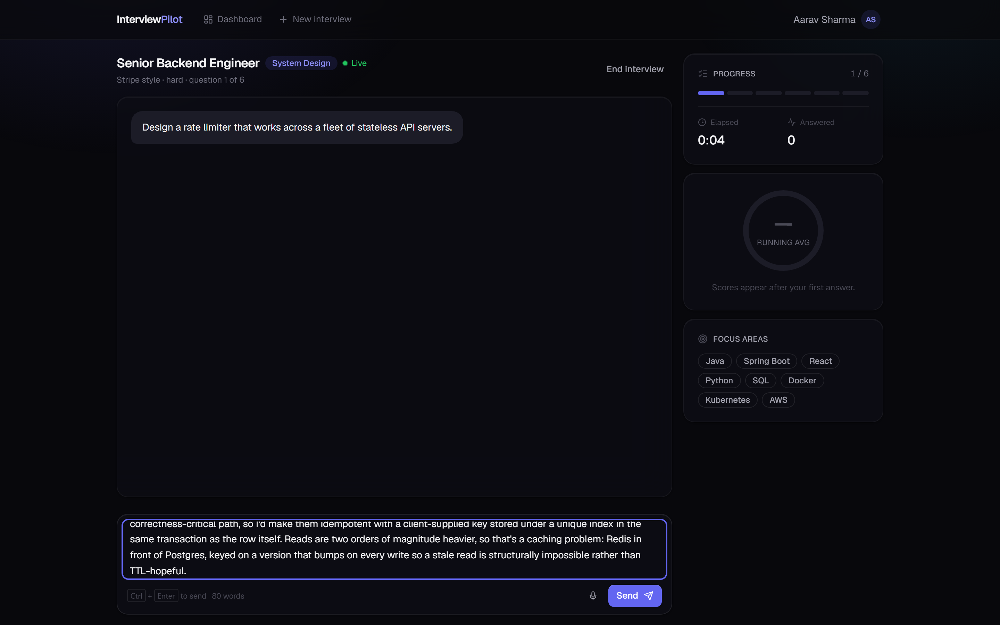

### Dashboard

Totals, average, streak, score-and-confidence trend, skill radar, and strong/weak skills —
all derived from per-answer evaluations rather than a single end-of-interview score.

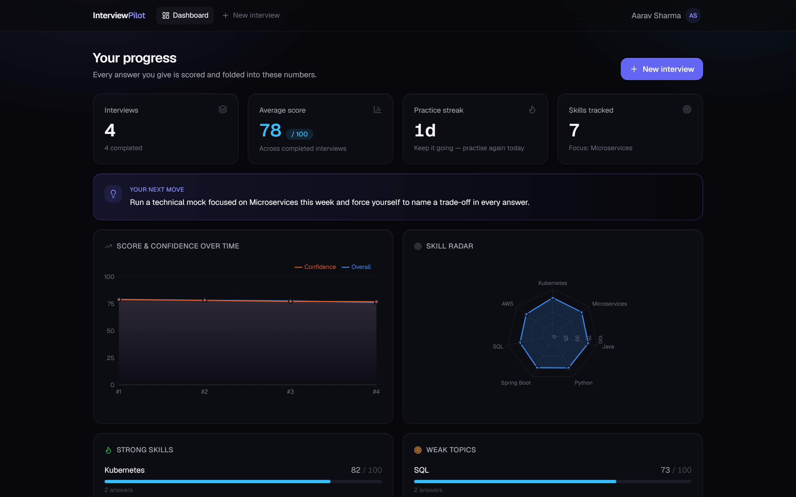

<details>
<summary>Full dashboard</summary>

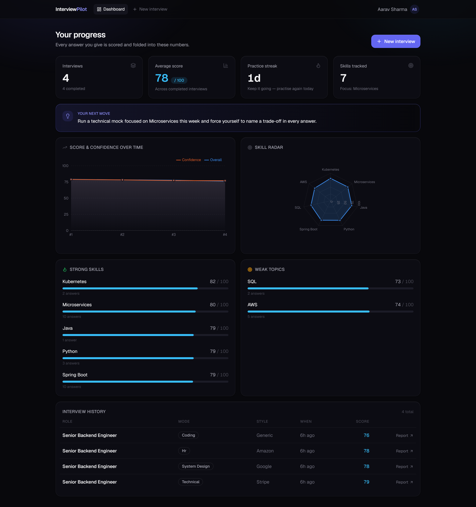

</details>

### Setting up a round

Upload a resume and paste a job description; both are parsed into structured profiles, and
the extracted skills are what the questions are built from.

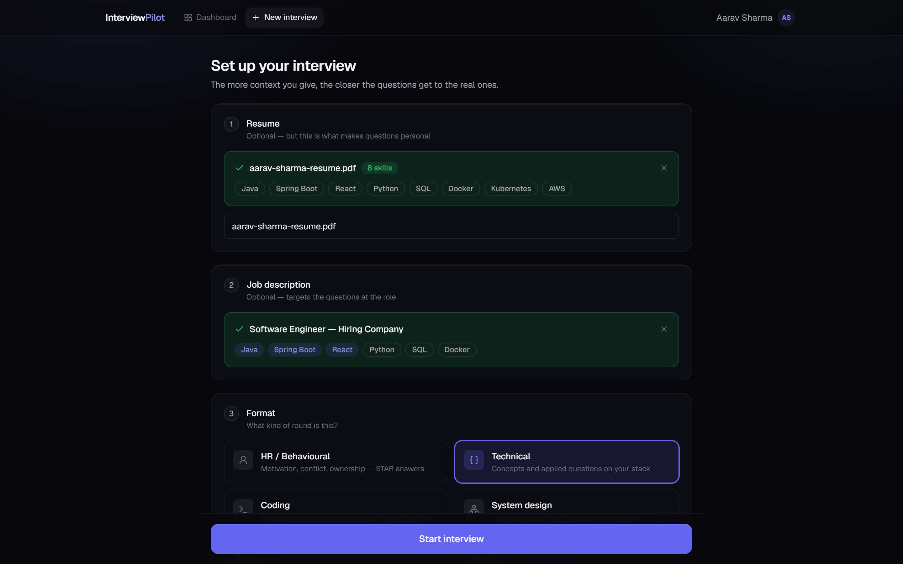

### The report

Overall score, readiness percentage, prep-time estimate, per-dimension breakdown, a skill
radar and the strengths/areas-to-improve split — exportable as PDF.

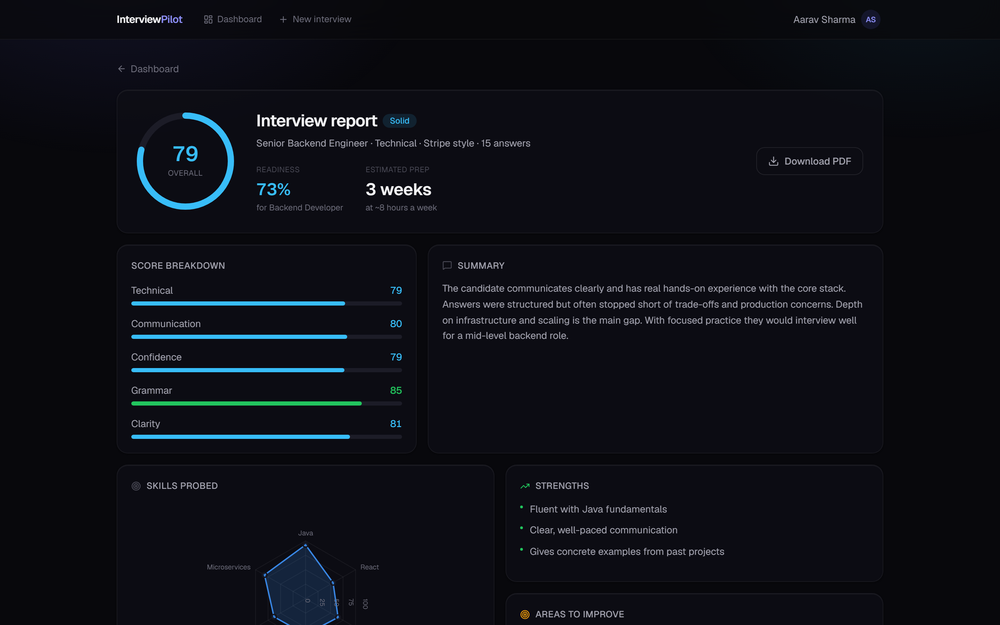

The coach turns the weak areas into something actionable: what you got wrong, what to
study, and an ordered plan with a mini project per topic.

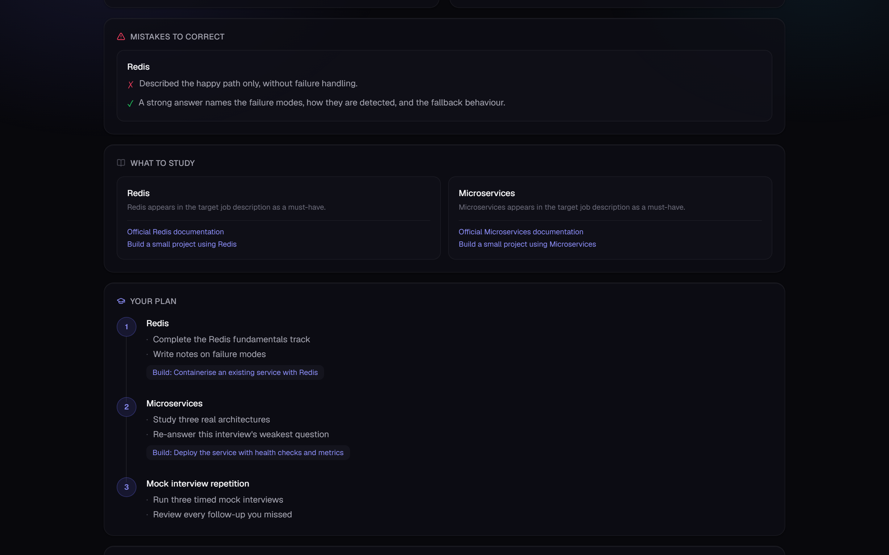

Every question, answer and score is kept, so a report can be read back turn by turn.

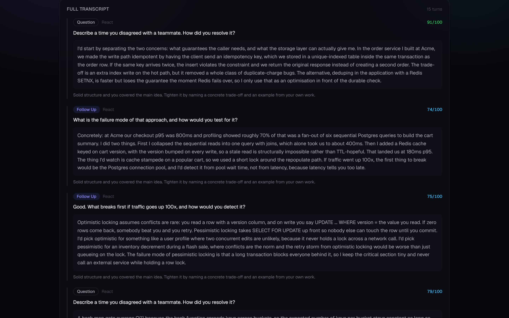

The same report for a system-design round, run in Google's interview style.

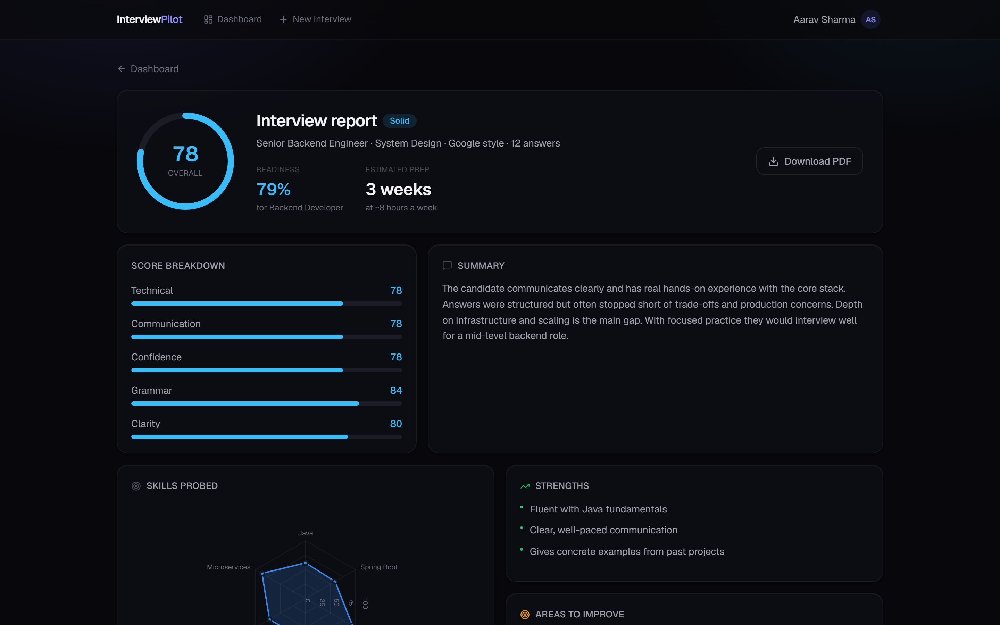

### Sign-in and API

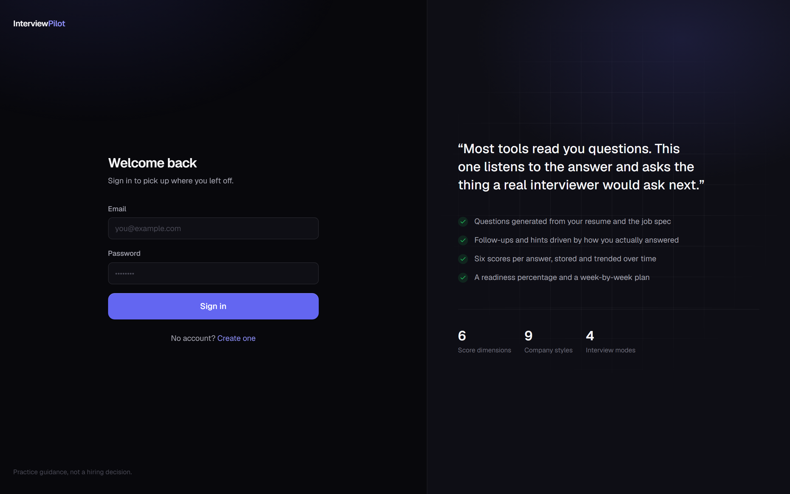

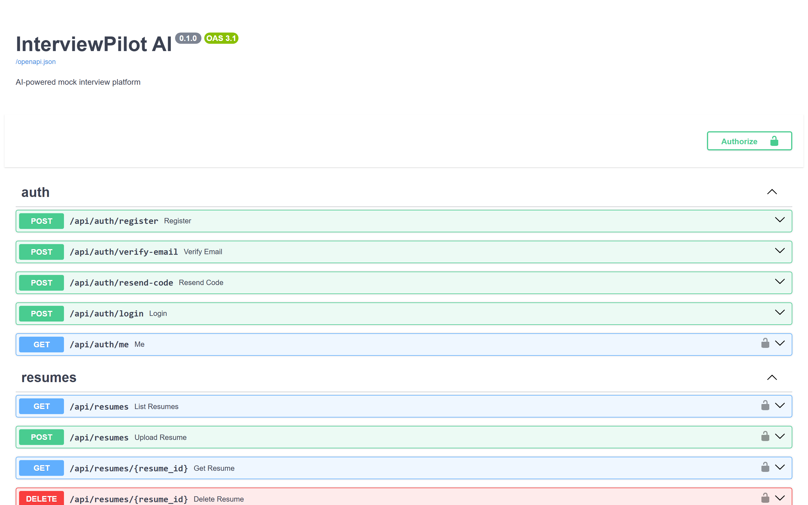

> Screenshots were captured against the built-in deterministic mock provider
> (`AI_PROVIDER=mock`), so the app runs end to end with no API key — see
> [It runs without an OpenAI key](#it-runs-without-an-openai-key).

---

## Quick start

Prerequisites: **Docker**, **Python 3.11+**, **Node 20+**.

```bash
# 1. infrastructure
docker compose up -d                 # Postgres on :5433, Redis on :6380

# 2. backend
cd backend
python -m venv .venv
.venv/Scripts/activate               # Windows;  source .venv/bin/activate on macOS/Linux
pip install -r requirements.txt
cp .env.example .env                 # works as-is; add OPENAI_API_KEY for real GPT
python scripts/init_db.py
python -m uvicorn app.main:app --reload --port 8000

# 3. frontend (new terminal)
cd frontend
npm install
cp .env.local.example .env.local
npm run dev
```

Open **http://localhost:3000**, create an account, and start an interview.
API docs are at **http://localhost:8000/docs**.

### Email verification

Sign-up sends a 6-digit code that must be confirmed before the account can be used.
Registration deliberately returns **no** access token — the session starts only after
`POST /api/auth/verify-email` succeeds.

**With no SMTP configured** (`EMAIL_PROVIDER=auto` and `SMTP_HOST` empty), the code is
printed to the backend terminal instead of emailed, and the verify screen says so. That
keeps sign-up working out of the box. To send real email, fill in the SMTP block in
`backend/.env`:

```bash
SMTP_HOST=smtp.gmail.com
SMTP_PORT=587
SMTP_USER=you@gmail.com
SMTP_PASSWORD=your-16-char-app-password   # a Google App Password, not your login
SMTP_USE_TLS=true
```

`REQUIRE_EMAIL_VERIFICATION=false` turns the whole gate off.

How a 6-digit secret is kept safe — the code alone is only ~20 bits:

| Control | Where |
|---|---|
| Stored as a keyed HMAC, never plaintext (key is `SECRET_KEY`, outside the DB) | `app/auth/otp.py` |
| Dies after 5 wrong guesses — the real brute-force bound | `otp_max_attempts` |
| Expires after 10 minutes | `otp_ttl_minutes` |
| Issuing a new code invalidates outstanding ones | `issue_code` |
| 60s resend cooldown, max 5 sends/hour | `otp_resend_cooldown_seconds`, `otp_max_sends_per_hour` |
| Constant-time comparison | `hmac.compare_digest` |
| `/resend-code` answers identically for unknown addresses (no enumeration) | `app/api/routes/auth.py` |
| Already-verified addresses are rejected with 409, never given a token | `verify_code` |

**Upgrading an existing database:** `create_all` does not alter existing tables, so run
the migration once. It adds the columns, creates `email_verifications`, and marks
pre-existing accounts verified so nobody is locked out:

```bash
python scripts/migrate_add_verification.py
```

### It runs without an OpenAI key

`AI_PROVIDER=auto` (the default) uses OpenAI when `OPENAI_API_KEY` is set and otherwise
falls back to a **deterministic mock provider**. The mock returns schema-valid, plausible
payloads for every AI stage, so the full product — extraction, adaptive questioning,
scoring, charts, PDF — works end to end offline. Drop a key into `backend/.env` to switch
to real GPT; nothing else changes.

---

## Architecture

```
                    Next.js 16 + TypeScript
                            │
        ┌───────────────────┼───────────────────┐
        │                   │                   │
   Dashboard         Interview Room          Reports
        │                   │                   │
        └────────── REST  +  WebSocket ─────────┘
                            │
                      FastAPI backend
                            │
 ┌────────────┬─────────────┬─────────────┬────────────┐
 │            │             │             │            │
Auth   Interview Engine  Evaluation   Reports    Ingestion
 │            │             │             │            │
 └────────────┴──────┬──────┴─────────────┴────────────┘
                     │
              AIProvider interface
                ├── OpenAIProvider (Responses API, structured outputs, streaming)
                └── MockProvider   (deterministic, no key required)
                     │
              PostgreSQL + Redis
```

### Backend layout

| Path | Responsibility |
|---|---|
| `app/ai/` | Provider interface, OpenAI client, mock provider, resume/JD ingestion |
| `app/prompts/` | One module per AI stage — extraction, interviewer, evaluator, coach |
| `app/schemas/` | Pydantic models; the `*_SCHEMA` ones are OpenAI Structured Output shapes |
| `app/interview/` | The adaptive engine and its guardrails |
| `app/evaluation/` | Per-answer scoring and score aggregation |
| `app/reports/` | Coach report generation + ReportLab PDF export |
| `app/websocket/` | Live interview transport |
| `app/auth/` | Swappable token verification (local JWT or Clerk) |
| `app/models/` | SQLAlchemy models |

### Why the engine has guardrails

The model *advises* the next move; `InterviewEngine._enforce_rules` *decides*. It caps
consecutive follow-ups at two, blocks hint-after-hint, refuses to end before a minimum
number of questions, and forces the end once the question budget is spent. A hallucinated
decision therefore cannot derail or prematurely end a session — there is a test for this
(`test_question_budget_is_enforced_server_side`).

---

## Feature status

| # | Feature | State |
|---|---|---|
| 1 | Email auth (JWT) + OTP email verification, Clerk-ready interface | **Working** |
| 2 | Dashboard: totals, average, streak, strong/weak skills, AI recommendation | **Working** |
| 3 | Resume upload → PDF text → structured profile | **Working** |
| 4 | Job description → structured requirements | **Working** |
| 5 | AI interview engine (dynamic, resume-aware questions) | **Working** |
| 6 | Follow-ups and hints driven by answer evaluation | **Working** |
| 7 | Modes: HR, Technical, Coding, System Design | **Working** |
| 8 | Voice interview (STT in, TTS out) | **Working** (STT wired into the room; TTS endpoint ready, no playback UI yet) |
| 9 | Per-answer JSON evaluation stored in Postgres | **Working** |
| 10 | AI coach: weak areas, recommendations, mini projects | **Working** |
| 11 | Analytics: radar, timeline, confidence trend, weak topics | **Working** |
| 12 | PDF report export | **Working** |
| 13 | Company mode (9 companies + generic) | **Working** |
| 14 | Career readiness % and prep-time estimate | **Working** |
| 15 | Recruiter dashboard | **API only** — invite create/list/claim endpoints exist; no recruiter UI yet |

Not yet built: Google/GitHub social login (set `AUTH_PROVIDER=clerk` and fill the Clerk
env vars to get it), Celery background jobs, and the recruiter front end.

---

## Testing

```bash
cd backend
.venv/Scripts/python -m pytest            # 8 tests, SQLite + mock provider, no Docker needed
python scripts/smoke_live.py              # hits a RUNNING server: HTTP + WebSocket + Postgres
```

```bash
cd frontend
npx tsc --noEmit
npm run build
```

The pytest suite covers the whole flow: resume upload → extraction → JD parsing →
adaptive interview → evaluation → report → PDF → dashboard, plus WebSocket round-trip,
auth rejection, and cross-user access isolation.

---

## Configuration

All backend settings live in `backend/.env` (see `.env.example`):

| Variable | Default | Notes |
|---|---|---|
| `AI_PROVIDER` | `auto` | `auto` \| `openai` \| `mock` |
| `OPENAI_API_KEY` | *(empty)* | Set it to use real GPT |
| `OPENAI_MODEL` | `gpt-5` | Main model; `OPENAI_MODEL_FAST` is used for evaluation and decisions |
| `AUTH_PROVIDER` | `local` | `local` \| `clerk` |
| `DATABASE_URL` | Postgres on `:5433` | Port 5433 avoids clashing with a local Postgres install |
| `SECRET_KEY` | dev placeholder | **Change before deploying** |

Frontend: `NEXT_PUBLIC_API_URL` in `frontend/.env.local`.

---

## Known limitations

- **Sync DB in async handlers.** Routes are `async def` but use a synchronous SQLAlchemy
  session, so a slow query blocks the event loop. Fine at this scale; move to
  `AsyncSession` + `asyncpg` before real traffic.
- **Question "streaming" is presentational.** Questions come from a Structured Output
  call, which must complete before it can be validated — the WebSocket then relays the
  finished line in chunks to drive the typewriter effect. `AIProvider.stream_text` does
  real token streaming and is available for free-form text.
- **Tables are created with `create_all`.** Alembic is installed but no migrations are
  authored yet; generate them before the first deploy.
- **Redis is provisioned but unused.** It is there for the session cache and Celery queue
  described in the roadmap.
- **`planned_questions` is a budget, not a guarantee** — follow-ups and hints are extra
  turns on top of it.

## License

MIT
